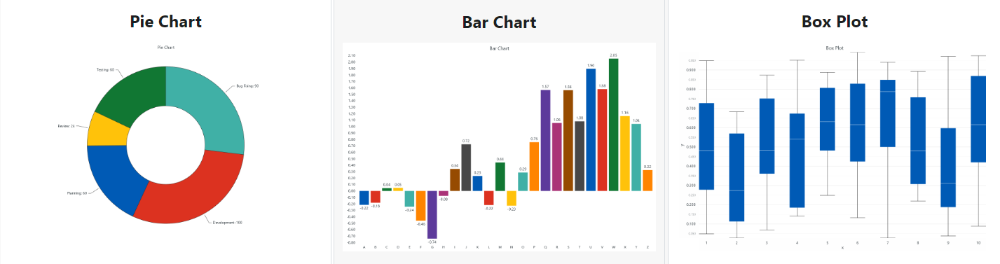
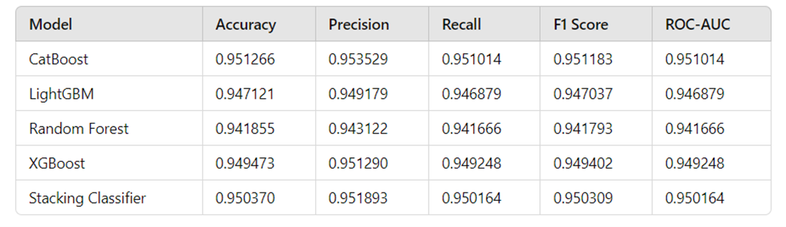

## Credit risk assessment using machine learning and LightningChart Python

### 1. Introduction

#### 1.1 What is credit risk assessment?
Credit risk assessment is the evaluation of the likelihood that a borrower will default on their loan obligations. It is a crucial part of financial risk management, helping institutions minimize losses due to bad loans.

#### 1.2 How have financial institutions benefited from machine learning applications for credit risk assessment?
Traditional methods often rely on manual evaluation and simple statistical models, which can be time-consuming and less accurate. Machine learning models, such as logistic regression and random forests, automate the process, providing faster and more accurate predictions by analyzing large datasets and identifying complex patterns.

#### 1.3 CatBoost Model for Credit Risk Assessment
We will use several machine learning models, including CatBoost Classifier, LGBM Classifier, Random Forest Classifier, XGB Classifier, and Stacking Classifier for their simplicity, interpretability, and their ability to handle large datasets and complex relationships. However, the best model is the CatBoost Classifier, which will be the primary focus in this project.

CatBoost Classifier is a machine learning (ML) model based on the gradient boosting decision tree (GBDT) framework. This framework is a popular ML technique used for both classification and regression tasks. The CatBoost Classifier stands out due to its powerful, versatile, and efficient performance in classification tasks, especially where the dataset includes categorical data. One of its key advantages is the ability to process categorical data directly without extensive preprocessing, making it particularly useful for credit risk modeling where such data is prevalent.

### 2. LightningChart Python 

#### 2.1 Overview of LightningChart Python
LightningChart is a high-performance charting library designed for real-time data visualization. Its Python wrapper allows for seamless integration with data analysis and machine learning workflows.

#### 2.2 Features and Chart Types to be Used in the Project
LightningChart Python offers a variety of chart types, each designed to handle specific types of data visualization needs. In this project, we use the following chart types to visualize stock price prediction data:

- **Bar Chart**: Used for visualizing categorical data as bars, making it easy to compare different categories side by side.
- **Stacked Bar Chart**: Allows for visualizing the composition of each category, showing how individual parts contribute to the whole.
- **Grouped Bar Chart**: Similar to the bar chart, but groups bars together based on additional categories, facilitating comparison within groups.
- **Pie Chart**: This kind of chart visualizes proportions and percentages between categories by dividing a circle into proportional segments, providing a clear view of category distribution.
- **Box Plot**: This chart type is used for visualizing data groups through quartiles. It is used to visualize the distribution of data based on statistical measures like quartiles, median, and outliers, providing insights into the data spread and variability.



#### 2.3 Performance Characteristics
LightningChart's performance is unmatched, handling millions of data points with ease and maintaining smooth user interactions. One of the standout aspects of LightningChart Python is its performance. The library is optimized for handling large volumes of data with minimal latency, which is crucial for financial applications where data needs to be processed and visualized in real-time to inform trading decisions.

### 3. Setting Up Python Environment

#### 3.1 Installing Python and Necessary Libraries
Install Python from the [official website](https://www.python.org/downloads/) and use pip to install necessary libraries including LightningChart Python from PyPI. To get the [documentation](https://lightningchart.com/python-charts/docs/) and the [license](https://lightningchart.com/python-charts/), please visit [LightningChart Website](https://lightningchart.com/).

```python
pip install lightningcharts random numpy pandas scikit-learn
```

```python
# Importing the libraries
import lightningchart as lc
import random
lc.set_license('my-license-key')

import numpy as np
import pandas as pd
import statsmodels.api as sm
from sklearn.preprocessing import LabelEncoder, StandardScaler
from sklearn.metrics import classification_report, accuracy_score, precision_score, recall_score, f1_score, roc_auc_score
from sklearn.ensemble import RandomForestClassifier
from sklearn.ensemble import ExtraTreesClassifier, StackingClassifier
from scipy.stats import probplot
from feature_engine.outliers import Winsorizer
from feature_engine.selection import DropConstantFeatures, DropDuplicateFeatures
from sklearn.pipeline import Pipeline
from xgboost import XGBClassifier, XGBRFClassifier
from catboost import CatBoostClassifier
from lightgbm import LGBMClassifier
from imblearn.over_sampling import BorderlineSMOTE
from collections import Counter
from yellowbrick.classifier import ClassPredictionError
from feature_engine.selection import DropCorrelatedFeatures
```

#### 3.2 Overview of Libraries Used
- **LightningChart**: Advanced data visualization.
- **NumPy**: Numerical computation.
- **Pandas**: Data manipulation and analysis.
- **Scikit-learn**: Data mining and data analysis.

#### 3.3 Setting Up Your Development Environment
Recommended IDEs include Jupyter Notebook, PyCharm, or Visual Studio Code.

### 4. Loading and Processing Data

#### 4.1 How to Load the Data Files
Data can be sourced from well-known databases like Kaggle, the world's largest data science and machine learning community.

```python
import pandas as pd

# Loading the dataset
data = pd.read_csv("./credit_risk_dataset.csv")
df.head()
```

#### 4.2 Handling and preprocessing the data
Preprocessing involves cleaning the data and handling missing values to make it suitable for machine learning models. 

```python
df = df.drop_duplicates()
df = df.dropna()
df.isnull().sum()
```

#### 4.3 Validation of the Study
In this project, we initially used five different models to assess their validity and performance in predicting credit risk. After evaluating the results, we selected the CatBoost Classifier as the best model for making predictions. Below are the performance metrics for each model tested:



### 5. Visualizing Data with LightningChart

#### 5.1 Introduction to LightningChart for Python
LightningChart Python allows for the creation of highly interactive and customizable charts. Here are some of the LC charts below:


#### 5.2 Creating the charts
To visualize the data, you can create various charts using LightningChart Python:

```python
import lightningchart as lc
import random

# Initialize LightningChart and set the license key
lc.set_license('my-license-key')

# Create a BarChart with stacked data using LightningChart
chart = lc.BarChart(title='Age Distribution by Loan Status')
```

#### 5.3 Customizing visualizations
LightningChart offers extensive customization options. You can change the theme and colors, add markers, hide or sort some features or integrate real-time data updates to enhance the visualization:

```python
chart = lc.BarChart(
    vertical=True, 
    theme=lc.Themes.White, 
    title='Age Distribution by Loan Status'
)
chart.set_data_stacked(
    categories,
    [
        {'subCategory': 'Good Loan Status', 'values': hist_good},
        {'subCategory': 'Bad Loan Status', 'values': hist_bad},
        {'subCategory': 'Overall Loan Status', 'values': hist_overall}
    ]
)
chart.set_value_label_display_mode('hidden')
chart.add_legend().add(chart)
chart.open()
```

### 6. Conclusion

#### 6.1 Recap of creating the application and its usefulness
This project demonstrated how to build a credit risk model using Python and visualize the results with LightningChart. The use of machine learning models improved prediction accuracy, while LightningChart provided high-quality data visualizations.

#### 6.2 Benefits of using LightningChart Python for visualizing data
LightningChart's advanced features and performance make it an excellent choice for financial data visualization, offering clear insights and aiding in decision-making processes.


